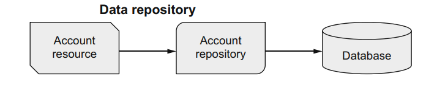

# Database access with Panache

**Hibernate ORM** (formerly JPA) is made simpler with **Panache**, which offers two different approaches for mapping db
data:

* _data repository_
* _active record_

## Database and user preparation

Make sure the db and the user are present in the db before running the application

```postgresql
CREATE USER quarkus_banking;
ALTER USER quarkus_banking WITH PASSWORD 'quarkus_banking';
create database quarkus_banking;
ALTER DATABASE quarkus_banking OWNER TO quarkus_banking;
```

## Data source configuration

Quakus supports many data source drivers for _h2_, _postgres_, _mysql_, _mariadb_ and _db2_.

Depending on the chosen one, the corresponding dependency ``quarkus-jdbc-<driver>`` must be added, as

```xml

<dependency>
    <groupId>io.quarkus</groupId>
    <artifactId>quarkus-jdbc-postgresql</artifactId>
</dependency>
```

**NOTE**: The regular jdbc dependencies can be also used, but with the quarkus ones, it is guaranteed that they will
work within a native application.

Once the driver dependency has been added, the datasource(s) can be configured.

```properties
#Default datasource example
quarkus.datasource.db-kind=postgresql
quarkus.datasource.username=database-user
quarkus.datasource.password=database-pwd
quarkus.datasource.jdbc.url=jdbc:postgresql://localhost:5432/my_database
#Datasource configuaration named orders
quarkus.datasource.orders.db-kind=postgresql
quarkus.datasource.orders.username=order-user
quarkus.datasource.orders.password=order-pwd
quarkus.datasource.orders.jdbc.url=jdbc:postgresql://localhost:5432/orders_db
```

## Traditional JPA (Hibernate ORM) approach

In JPA all ORM is regulated by the _EntityManager_ for the entity mapping itself and the CRUD operations with entities.


To use JPA in combination with PostgreSQl we need the following dependencies

````xml

<dependency>
    <groupId>io.quarkus</groupId>
    <artifactId>quarkus-hibernate-orm</artifactId>
</dependency>
<dependency>
<groupId>io.quarkus</groupId>
<artifactId>quarkus-jdbc-postgresql</artifactId>
</dependency>
````

We annotate the ``Account`` class with  ``@Entity`` with field specific annotations (for id, data type, validation
etc...)

```java
@Entity
@NamedQuery(name = "Accounts.findAll",
        query = "SELECT a FROM Account a ORDER BY a.accountNumber")
@NamedQuery(name = "Accounts.findByAccountNumber",
        query = "SELECT a FROM Account a WHERE a.accountNumber = :accountNumber 
        ORDER BY a.accountNumber")
        ...
        public class Account{
        @Id
        @SequenceGenerator(name = "accountsSequence", sequenceName = "accounts_id_seq", allocationSize = 1, initialValue = 10)
        @GeneratedValue(strategy = GenerationType.SEQUENCE, generator = "accountsSequence")
        private Long id;
        private Long accountNumber;
        ...
        }
```

When we want to interact with the entity

````java
public class AccountResource {
    @Inject
    EntityManager entityManager;

    @GET
    public List<Account> allAccounts() {
        return entityManager
                .createNamedQuery("Accounts.findAll", Account.class) B
                .getResultList();
        c
    }

    public Account getAccount(@PathParam("acctNumber") Long accountNumber) {
        try {
            return entityManager
                    .createNamedQuery("Accounts.findByAccountNumber", Account.class) B
                    .setParameter("accountNumber", accountNumber) c
                    .getSingleResult();
            d
        } catch (NoResultException nre) {
            e
            throw new WebApplicationException("Account with " + accountNumber
                    + " does not exist.", 404);
        }
    }

    /**
     * Tells Quarkus that a transaction should be created for this operation A transaction is necessary here 
     because any exception from within the method needs to result in a “rollback” of any proposed 
     database changes before they’re committed. In this case it’s a new Account.
     */
    @Transactional
    public Response createAccount(Account account) {
        ...
        entityManager.persist(account);
        c
        return Response.status(201).entity(account).build();
    }


    @Transactional
    public Account withdrawal(@PathParam("accountNumber") Long accountNumber,
                              String amount) {
        //here the account id managed because it is loaded by the entity
        Account entity = getAccount(accountNumber);
        entity.withdrawFunds(new BigDecimal(amount));
        return entity;
    }


    @Transactional
    public Account updateBalance(Account account) {
        //here we need to merge because the input account is an unmanaged entity 
        entityManager.merge(account);
        B
        return account;
    }
}
````

### Testing with JPA

One drawback of using JPA is that it needs to include the interaction with the database.
For that we use an _h2_ driver for _test_ profile only.

In order to use the h2 database for testing we first need to add the dependencies

````xml

<dependency>
    <groupId>io.quarkus</groupId>
    <artifactId>quarkus-test-h2</artifactId>
    <scope>test</scope>
</dependency>
<dependency>
<groupId>io.quarkus</groupId>
<artifactId>quarkus-jdbc-h2</artifactId>
<scope>test</scope>
</dependency>
````

And the following configuration

```properties
# data source configuration for production, when building the application, and for Live Coding
quarkus.datasource.db-kind=postgresql
quarkus.datasource.username=quarkus_banking
quarkus.datasource.password=quarkus_banking
quarkus.datasource.jdbc.url=jdbc:postgresql://localhost/quarkus_banking
#Defines the data source configuration for tests
%test.quarkus.datasource.db-kind=h2
%test.quarkus.datasource.username=username-default
#overwrites the password to empty (not needed in h2)
%test.quarkus.datasource.password=
%test.quarkus.datasource.jdbc.url=jdbc:h2:tcp://localhost/mem:default
#at bootstrap quarkus will drop and recreate the database
quarkus.hibernate-orm.database.generation=drop-and-create
#the sql script containing initialization data
quarkus.hibernate-orm.sql-load-script=import.sql
```

With this settings in place there is no need to add a _persistence.xml_ file as we do for a normal JEE application;
that's because Quarkus will do it for us looking at the extensions being used and the configuration in the properties
files.

Test class

```java

@QuarkusTest
@QuarkusTestResource(H2DatabaseTestResource.class) //tells quarkus to start an H2 db before the test starts
@TestMethodOrder(OrderAnnotation.class)
public class AccountResourceTest {
    @Test
    @Order(1)
    void testRetrieveAll() {
        Response result =
                given()
                        .when().get("/accounts")
                        .then()
                        .statusCode(200)
                        .body(
                                containsString("Debbie Hall"),
                                containsString("David Tennant"),
                                containsString("Alex Kingston")
                        )
                        .extract()
                        .response();
        List<Account> accounts = result.jsonPath().getList("$");
        assertThat(accounts, not(empty()));
        assertThat(accounts, hasSize(8));
    }
}
```

## Panache _active record_ approach

All interactions occur through the entity itself. As objects usually hold data that needs to be stored, the active
record approach puts the data access logic into the domain
object directly


Dependencies

```xml

<dependency>
    <groupId>io.quarkus</groupId>
    <artifactId>quarkus-hibernate-orm-panache</artifactId>
</dependency>
<dependency>
<groupId>io.quarkus</groupId>
<artifactId>quarkus-jdbc-postgresql</artifactId>
</dependency>
```

The class is ````AccountAr````

## Panache _data repository_ approach

Here we want to separate the data access logic (in repo classes) from the entities

The dependencies don't change

```xml

<dependency>
    <groupId>io.quarkus</groupId>
    <artifactId>quarkus-hibernate-orm-panache</artifactId>
</dependency>
<dependency>
<groupId>io.quarkus</groupId>
<artifactId>quarkus-jdbc-postgresql</artifactId>
</dependency>
```

The classes are ``AccountR`` and ``AccountRepository``



## Deploy to Kubernetes

When the Postgres application is installed in the cluster a _Secret_ is generated with the following

```yaml
kind: Secret
apiVersion: v1
metadata:
  name: postgresql
data:
  database-name: c2FtcGxlZGI=
  database-password: ZVRVY1BpYWlxVmtJb3BWOA==
  database-user: dXNlcjJUTg==
type: Opaque
```

With this in place we add the Secret support to the application with the following dependency

```xml
<dependency>
    <groupId>io.quarkus</groupId>
    <artifactId>quarkus-kubernetes-config</artifactId>
</dependency>
```

The configuration is 

```properties
# Openshift Postgres settings for prod
%prod.quarkus.kubernetes-config.enabled=true
# to use secrets in openshift as configuration source
%prod.quarkus.kubernetes-config.secrets.enabled=true
# the secret name containing the postgres credentials
%prod.quarkus.kubernetes-config.secrets=postgresql

# Postgres prod (default) datasource config

# the placeholder name is the key in the  postgresql secret in the cluster
%prod.quarkus.datasource.username=${database-user}
%prod.quarkus.datasource.password=${database-password}
# the format is retrived from the postgres Service info in the cluster (ClusterIp service)
# URL FORMAT: <servicename>.<namespace>.svc.<clustername>:<port>/<database>
%prod.quarkus.datasource.jdbc.url=jdbc:postgresql://postgresql.xan80-dev.svc.cluster.local:5432/${database-name}
```

The ``jdbc.url`` has the host retrieved from the _ClusterIp_ service exposed by Postgres

```shell
# this doesn't contain the cluster name part 
oc get svc nexus -o go-template --template='{{.metadata.name}}.{{.metadata.namespace}}.svc{{println}}'

postgresql.xan80-dev.svc

```


