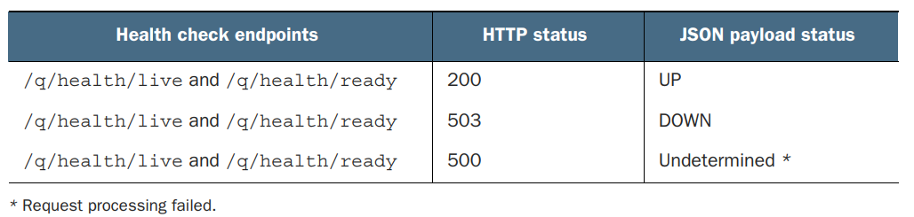
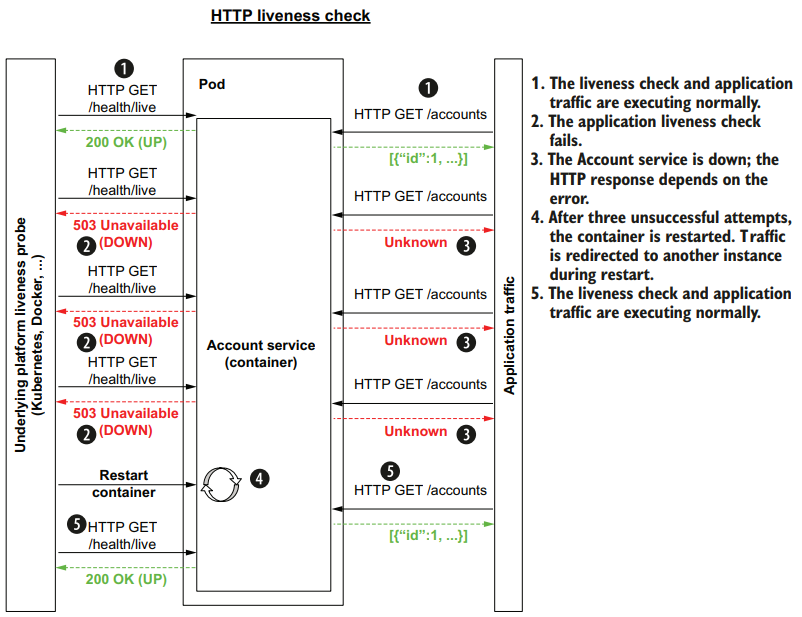
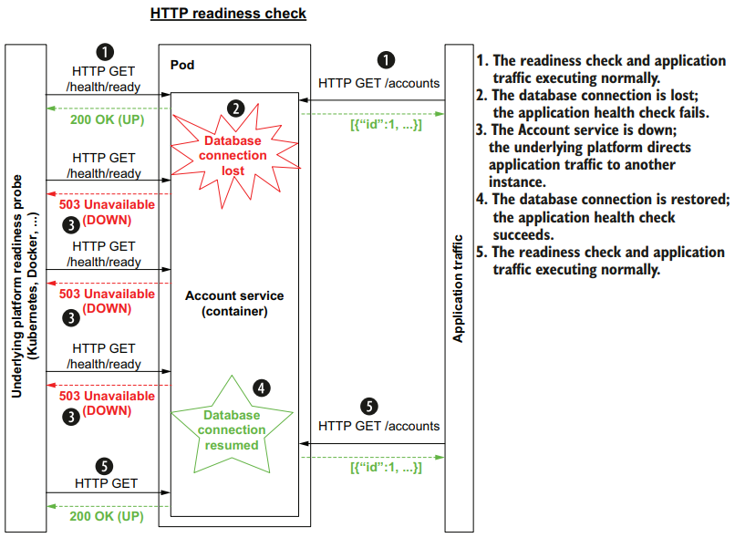

# **MicroProfile** health

Kubernetes uses _probes_ to check the exposed health and take corrective
action if necessary. 
_**MicroProfile Health**_ is an API to expose application heath and follow that by covering how Kubernetes liveness and
readiness probes can take corrective action.

With a formal contract in place, the platform can restart failing application containers and pause traffic to an containerized
application that is not ready to accept traffic.

_MicroProfile_ health defines the following:

* **Health endpoints**: ``/health/live`` and ``/health/ready`` as _liveness_ and _readiness_ probes used by Kubernetes
* **HTTP status code(s)**: to map the status to the corresponding code
* **HTTP response payload**: JSON payload also provides status, along with additional health metadata and context
* **Application liveness**: Specifies whether an application is up and running properly.
* **Application readiness**: Specifies whether an application is ready to accept traffic
* **Application health API**: Exposes application readiness and liveness based on custom application log

## Liveness and readiness

If the application is not ready, then the underlying platform will not send traffic to the application.
An application can be “live” but not be “ready.”   It may take time to prepopulate an in-memory cache or connect to an external service. During this time, the application is live and running properly but may not be ready to receive
external traffic because a service it depends on may not be running properly.

## Health

Sending an HTTP request to the ``/health`` endpoint returns the combined liveness and readiness status. MicroProfile Health has deprecated this
endpoint in favor of separate ``/health/live`` and ``/health/ready`` endpoints.
Quarkus prefers using ``/q/health/live`` and ``/q/health/ready`` endpoints directly to avoid an HTTP redirect.

The platform (Kubernetes) can use either the response status code or the response JSON:



| Liveness | Readiness |
|----------|-----------|
| ||


## Activate health check in quarkus

Extension

```xml
<!-- MicroProfile Health API-->
<dependency>
    <groupId>io.quarkus</groupId>
    <artifactId>quarkus-smallrye-health</artifactId>
</dependency>
```
With this extension in place, the probe endpoints will be exposed

```shell
GET http://localhost:8080/q/health/live

HTTP/1.1 200 OK

{ "status": "UP", "checks": [] }
```


## Customized liveness probe

We can add many implementations of the ``HealthCheck`` interface with the annotation for the type of check (`@Liveness` `@Readiness`)

Each implementation will implement a specific check that will be added to the list of checks to determine the final status

```java
@ApplicationScoped
@Liveness //This is a liveness health check
public class AlwaysLiveLivenessCheck implements HealthCheck {

    @Override
    public HealthCheckResponse call() {
        return HealthCheckResponse
                .named("Always live")
                .withData("time", String.valueOf(new Date()))
                .up()
                .build();
    }
}
```

This check is driven by the config, which can be changed by the ``HealthConfigResource``
```java
@ApplicationScoped
@Liveness
public class HealthConfigBasedLivenessCheck implements HealthCheck {

    @Inject
    private HealthConfig healthConfig;

    @Override
    public HealthCheckResponse call() {
        return HealthCheckResponse.named("HealthConfigBased")
                .withData("Config value", healthConfig.isHealty())
                .status(healthConfig.isHealty())
                .build();
    }
}
```

This is the output of the livenss check: note the response code and the status

````shell
GET http://localhost:8080/q/health/live

HTTP/1.1 503 Service Unavailable
content-type: application/json; charset=UTF-8
content-length: 388

{
  "status": "DOWN",
  "checks": [
    {
      "name": "HealthConfigBased",
      "status": "DOWN",
      "data": {
        "Config value": false
      }
    },
    {
      "name": "Always live",
      "status": "UP",
      "data": {
        "time": "Wed Jul 12 09:00:18 CEST 2023"
      }
    }
  ]
}
````

## MicroProfile readiness checks

If we use the prebuild readiness probe we see that the Hibernate ORM with Panache extension automatically adds the 
Agroal data source extension as an application dependency. The **Agroal** datasource extension 
provides the readiness health check. 
All relational databases supported by Quarkus will benefit from a readiness check.

**NOTE**: Quarkus extensions that provide client
connectivity to backend services have built-in readiness health checks, including relational and nonrelational databases, messaging systems like Kafka and
JMS, Amazon services like S3 and DynamoDB, and more 

````shell

GET http://localhost:8080/q/health/ready

HTTP/1.1 200 OK

{ "status": "UP", 
  "checks": [{
      "name": "Database connections health check",
      "status": "UP",
      "data": {
        "<default>": "UP"
      }
    }]
}
````

### Disable the vendor readiness check

Two ways

#### Disable all vendor readiness checks

Change the MicroProfile Health configuration 

```properties
mp.health.disable-default-procedures=true
```

#### Disable specific extension's vendor readiness checks

```properties
# quarkus.<client>.health.enabled=false

quarkus.datasource.health.enabled=false
```


## Custom readiness check

**NOTE**: This check should be added to the _transaction-service_ because it is dependent on the ``AccountService`` to be available in order to be ready

```java
@Readiness
@ApplicationScoped
public class AccountHealthReadinessCheck implements HealthCheck {

    @Inject
    @RestClient
    private AccountService accountService;

    @Override
    public HealthCheckResponse call() {
        BigDecimal balance = BigDecimal.valueOf(Integer.MIN_VALUE);
        try {
            balance = accountService.getBalance(999999999L);
        } catch (WebApplicationException ex) {
            if (ex.getResponse().getStatus() >= 500) {
                return HealthCheckResponse
                        .named("AccountServiceCheck")
                        .withData("exception", ex.toString())
                        .down()
                        .build();
            }
        }
        return HealthCheckResponse
                .named("AccountServiceCheck")
                .withData("balance", balance.toString())
                .up()
                .build();
    }

}
```

## Health checks in Kubernetes

The configuration for health checks in Kubernetes can be steered by Quarkus configuration in the ``application.properties`` file


| KB8 config              | Qaurkus config                                                                                                     | Description and Quarkus defaults                                                                                             |
|-------------------------|--------------------------------------------------------------------------------------------------------------------|------------------------------------------------------------------------------------------------------------------------------|
| ``initialDelaySeconds`` | ``quarkus.kubernetes.livenessprobe.initial-delay``<br/>``quarkus.kubernetes.readinessprobe.initial-delay``         | The amount of time to wait before starting to probe. Defaults to 0 seconds                                                   |
| ``periodSeconds``       | ``quarkus.kubernetes.livenessprobe.period``<br/>``quarkus.kubernetes.readinessprobe.period``                       | Probes interval. Default 30 sec                                                                                              |
| ``timeout``             | ``quarkus.kubernetes.livenessprobe.timeout``<br/>``quarkus.kubernetes.readinessprobe.timeout``                     | Amount of time to wait for probe to complete. Defaults to 10 seconds                                                         |
| ``successThreshold``    | ``quarkus.kubernetes.livenessprobe.success-threshold``<br/>``quarkus.kubernetes.readinessprobe.success-threshold`` | Minimum consecutive successful probes to be considered successful after having failed. Defaults to 1. Must be 1 for liveness |
| ``failureThreshold``    | ``quarkus.kubernetes.livenessprobe.failure-threshold``<br/>``quarkus.kubernetes.readinessprobe.failure-threshold`` | Retry failureThreshold times before giving up. Giving up on a liveness probe will restart container. Giving up on a readiness probe will pause traffic to container.Defaults to 3.|

More config on https://quarkus.io/guides/

This is the Kubernetes configuration generated

```yaml
...
livenessProbe:
    failureThreshold: 
    httpGet: 
        path: /q/health/live 
        port: 80 
        scheme: HTTP 
    initialDelaySeconds: 0
    periodSeconds: 30
    successThreshold: 1
    timeoutSeconds: 10
...
``` 


