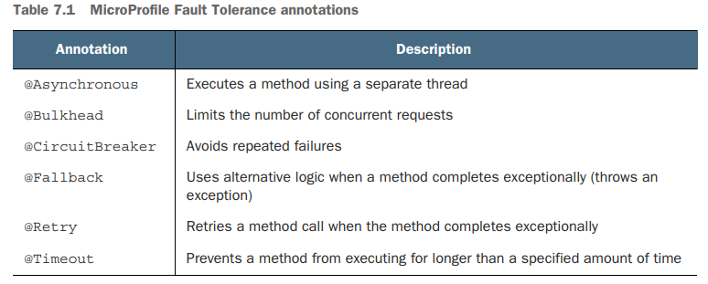
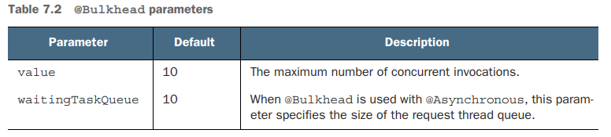
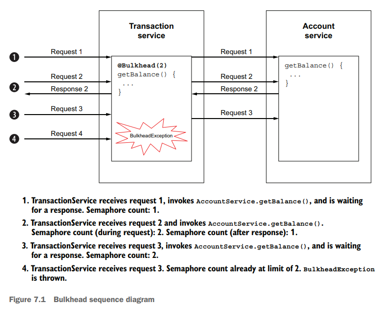
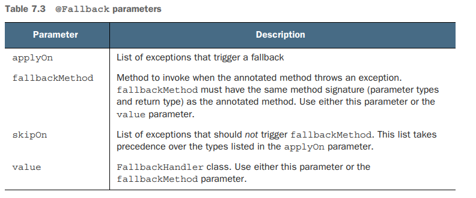
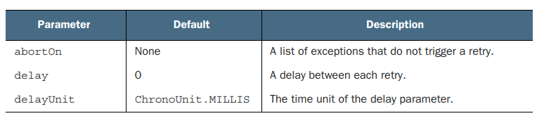
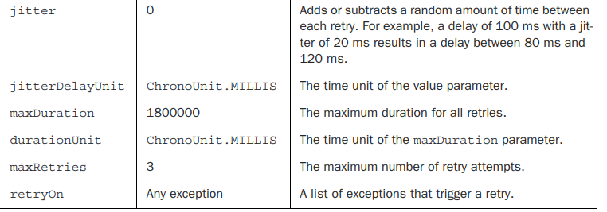
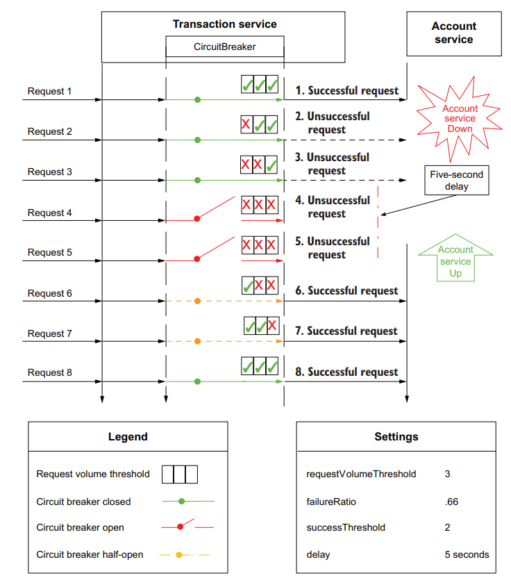
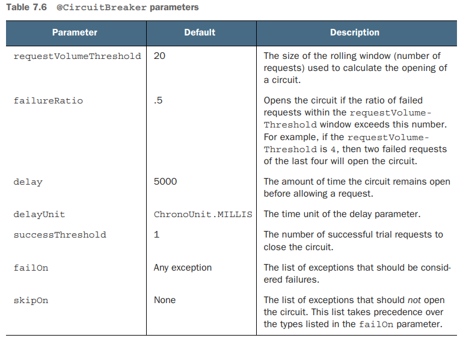

## Resilience strategies

Extension

```xml

<dependency>
    <groupId>io.quarkus</groupId>
    <artifactId>quarkus-smallrye-fault-tolerance</artifactId>
</dependency>
```



### Using _@Asynchronous_

Instead of blocking a worker thread by waiting for a response, the @Asynchronous annotation uses a separate thread to
invoke the remote service to increase concurrency and throughput. See
the next code listing for an example.

This book does not advocate using the @Asynchronous annotation with Quarkus and
will not cover the annotation in detail. The @Asynchronous annotation is for runtimes
that make heavy use of threads and thread pools to achieve higher concurrency and
throughput, like Jakarta EE runtimes. Quarkus uses a nonblocking network stack and
event loop execution model based on Netty and Eclipse Vert.x. It can achieve higher
concurrency and throughput using its inherent asynchronous and reactive APIs while
using less RAM and CPU overhead.
For example, the Quarkus RESTEasy Reactive extension enables the use of JAX-RS
annotations and handles requests directly on the IO thread. Developers can use the
APIs they already know while benefiting from the throughput typically reserved for
asynchronous runtimes like Vert.x.

### Constraining concurrency with bulkheads (paratie)

The bulkhead concept comes from shipbuilding, which constrains a compromised section of a ship’s hull by closing
bulkhead doors to isolate the incoming water.
The bulkhead architectural pattern applies this concept to prevent a failure in one service from cascading to another
service by limiting the number of concurrent method invocations.
For instance in case of calls to time-consuming external services might cost to exhaust the worker thread pool (
specially if applications like Jakarta EE ans Spring use one worker thread per request)

MicroProfile Fault Tolerance specifies bulkheads using the @Bulkhead annotation, which can be applied to either a method
or a class. See the next listing for an
example.

```java
//
@Bulkhead(10)
public String invokeLegacySystem(){
        ...
        }
```



The @Bulkhead annotation can be used together with _@Asynchronous_, _@CircuitBreaker_, _@Fallback_, _@Retry_, and
_@Timeout_

The values uses a semaphore based on the number of unanswered concurrent request



## Exception handling with _@Fallback_



```java
 @GET
@Path("/call-with-fallback/{inputCode}")
@Bulkhead(value = 1)
@Fallback(fallbackMethod = "bulkheadFallback", //Method name of the fallback impl with the same signature as the resource method
        applyOn = {BulkheadException.class})
public Response exampleWithFallbackMethod(@PathParam("inputCode") String inputCode) {
    if("emulate-fallback".equals(inputCode)){ //this is usually not needed
        throw new BulkheadException("Emulated bulkhead exception");
    }
    return Response.ok().entity(this.verySlowServiceCaller.doCallResponseAfter10Sec()).build();
}

public Response bulkheadFallback(String inputCode){
    log.info("Falling back to ResilienceStrategiesResource#bulkheadFallback()");
    return Response.status(Response.Status.TOO_MANY_REQUESTS).build();
}
```

## Executions _@Timeout_

```java
@GET
@Path("/call-with-timeout")
@Timeout(100) //need to complete in less than 100 ms or a TimeoutException will be thrown
@Fallback(fallbackMethod = "timeoutFallback") //if any exception is thrown
@Produces(MediaType.APPLICATION_JSON)
public Response getTimeout() throws InterruptedException {
    Thread.sleep(200);
    return Response.ok().build();
}
public Response timeoutFallback() {
    return Response.status(Response.Status.GATEWAY_TIMEOUT).build();
}
```

## Recovering from temporary failure with _@Retry_

The @Retry annotation retries method invocations a configurable number of
times if the method completes exceptionally. It is a **failure recovery strategy**




```java
    @GET
    @Path("/call-retry")
    @Timeout(100)
    @Retry(delay = 100, //delay between reties
            jitter = 25, //variance of time between reties (85 - 125)
            maxRetries = 3,
            retryOn = TimeoutException.class) //other exceptions will be handled normally
    @Fallback(fallbackMethod = "timeoutFallback")
    public Response getRetry() {
        //the service method will delay the return to trigger the timeout for 2 times only
        return Response.ok().entity(serviceForRetry.doesNotDelayAfterRepeatedCalls()).build();
    }
```

## Avoiding repeated failure with circuit breakers

A circuit breaker avoids operations that are likely to fail. 
It is a resilience pattern popularized by the _Netflix Hystrix framework_ and is also the most complex resilience pattern to understand. 

A circuit breaker consists of the following three steps:
1. Detect repeated failure, typically of expensive operations like a remote service
invocation.
1. “Fail fast” by immediately throwing an exception instead of conducting an expensive operation.
3. Attempt to recover by occasionally allowing the expensive operation. If successful, resume normal operations.

### How a circuit breaker works



The circuit breaker logic holds a rolling window of the last _**requestVolumeThreshold**_ size.
If the _**failureRatio**_ percentage of the window size is reached (Request 4), then the circuit breaker opens;
this means that the next call (5) will be delayed of _**delay**_ time. When the first succesfull call happens, 
the breaker is half open until the _**successThreshold**_ is reached.



```java
    @GET
    @Path("/call-circuit-breaker")
    @Bulkhead(1)
    @CircuitBreaker(
            requestVolumeThreshold=3,
            failureRatio=.66,
            delay = 5,
            delayUnit = ChronoUnit.SECONDS,
            successThreshold=2
    )
    @Fallback(value = TransactionServiceFallbackHandler.class) //handler class to support multiple type of exceptions
    public Response callCircuitBreakerService() {
        return Response.ok().entity(circuitBreakerBackendService.callService()).build();
    }
```


This can be tested with repeated calls to 

```httpclient
GET http://{{host}}/resilience/call-circuit-breaker
Accept: application/json
```

## Overriding annotation parameter values using properties

MicroProfile Fault Tolerance can globally enable or disable fault tolerance annotations or modify annotation parameters at runtime using properties.
This will allow the developers to disable fault tolerance features in case the production environment uses _**service mesh**_ solutions;
those give the operations team more control and visibility into a microservices deployment, are becoming more common. 
A service mesh can shape network traffic and apply its own fault tolerance features to maintain a more reliable Kubernetes cluster. By externalizing fault tolerance annotation parameters using
properties, the operations team can ensure that application @Timeout or @Retry annotations do not conflict with the equivalent service mesh settings.

Four ways to enable/disable fault tolerance annotations using properties follow:
1. `MP_Fault_Tolerance_NonFallback_Enabled=true` Disables all fault tolerance annotations, except for @Fallback annotations.
1. `<annotation>/enabled=false` Disables all fault tolerance annotations of a specific type used within the application. 
   For example, `Bulkhead/enabled=false` disables all bulkheads in the application.
1. `<class>/<annotation>/enabled=false` Disables the specified annotation on the specified class. For example, `io.quarkus.transactions.TransactionResource/Timeout/enabled=false` disables all @Timeout annotations defined
on the TransactionResource class and any of its methods. 
1. `<class>/<method>/<annotation>/enabled=false` Disables the specified annotation on a specified method in the specified class. For example, 
   `io.quarkus.transactions.TransactionResource/getBalance/Timeout/enabled=false` disables the @Timeout annotation on the TransactionResource.getBalance() method, and all other @Timeout annotations in TransactionResource are unaffected.

